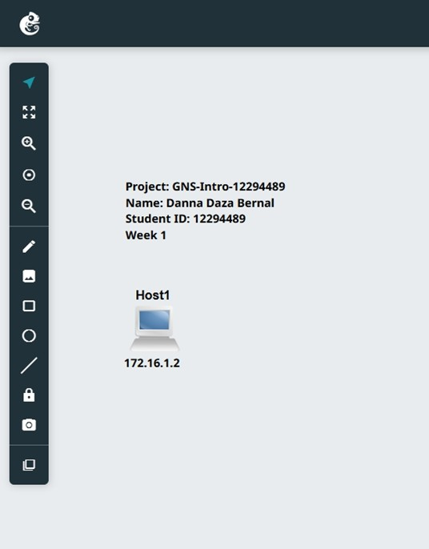
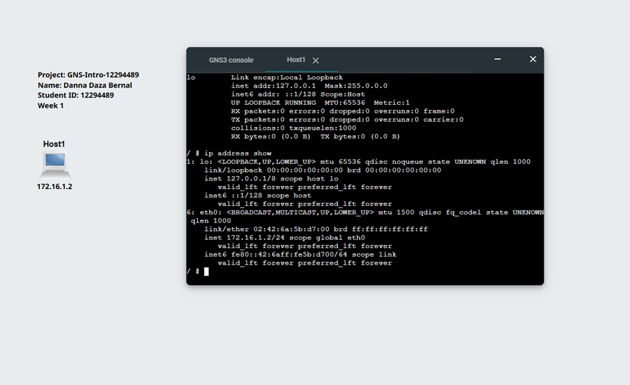

# **Week 1:** 
## Introduction to the Internetworking 
## Introduction to GNS3 
The aim of this activity is to quickly familiarise with the GNS3 project creation process, adding and configuring IP addresses of nodes, adding annotations, starting and stopping nodes, and running Linux commands in the console in the web browser.

This week's tutorial focused on using VirtualBox to create and manage virtual machines. GNS3 was used to design and implement network topologies, enabling the practical configuration and testing of networking concepts. Together, these tools provided a realistic environment in which to explore and understand internetworking principles.

### Activity 1: 
1. Create a new project named GNS3-Intro-<studentid>, replacing with your actual student ID number, e.g., GNS-Intro-12345678.
   
   For this activity, I created a project called 'GNS3 Intro'. The link to the project is below.
   
   [GNS3 Project](project_files/GNS-Intro-12294489.gns3project)
   
3. Screenshot of the network
   
   In the next step, I added a Linux host node. Using the GNS3 tools, I added text showing the title, my name and student ID. I also added a text label to the host to show its IP address, as shown in the following image. 
   
4. Screenshot of the console showing the IP address

   For this step, I configured the IP address of the Linux host node, started the node and opened the console. I then used the 'ip address show' command to display the output and verify that the IP address had been configured correctly, as shown in the following image.
   .

## Reflection 

This week, I focused on preparing for the unit. I installed the necessary software, such as VirtualBox and GNS3, and created a GitHub repository to organise my work. Initially, the number of tools involved made it feel a bit overwhelming, but once everything was installed, I found it easier to understand how they connect together.

I also learnt how to create a basic project in GNS3 and assign an IP address to a host using the configuration file. Although this was a simple task, it helped me to understand the importance of IP addressing in networking.
