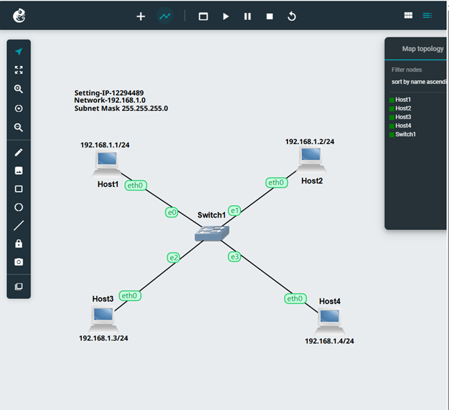
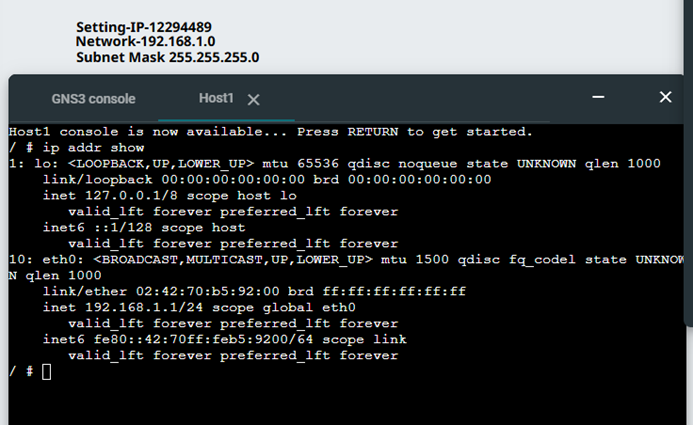
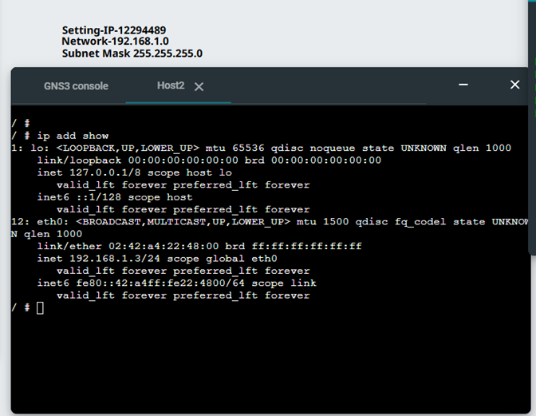
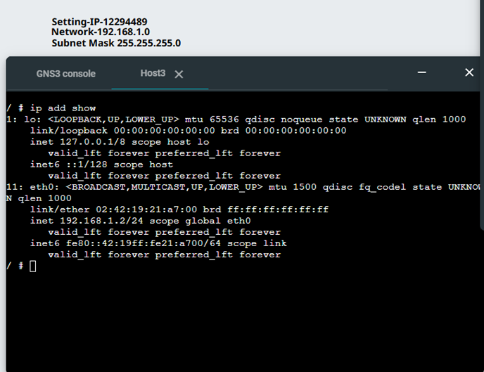
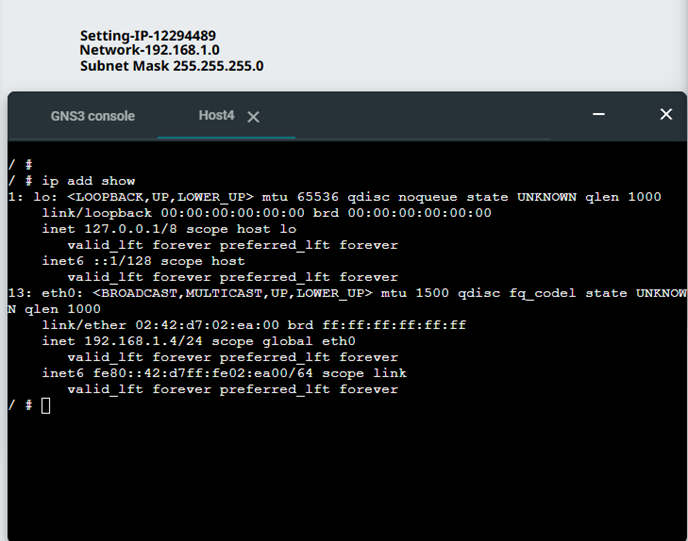
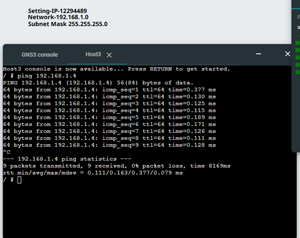
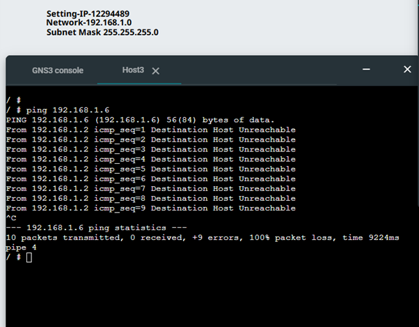
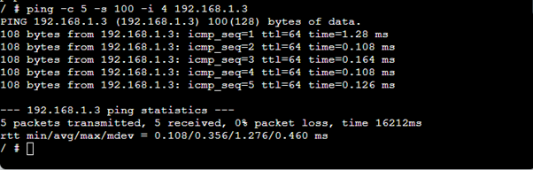

# **Week 2**
## Encapsulation and Decapsulation in Network Communication
## Setting Static IP Address 

The aim of this activity is to set an IP address on a Linux host using VirtualBox and GNS3, employing three different methods.
First, I created a new project called 'Setting IP' and added four Linux host nodes and one Ethernet switch. Then, I connected them together to form a local area network (LAN).

## Activity 1

1. Exported project, e.g., Setting-IP-<studentid>.gns3project

   For this activity, I created a project called 'GNS3 Setting IP'. The link to the project is below.

   [GNS3-SETTING-IP](project_files/Setting-IP-12294489.gns3project)

2. Screenshot of the network, e.g., Setting-IP-<studentid>-network.png

   In this step, I used four Linux hosts and one Ethernet switch to create the network and add labels to each host to define the IP address. This was done before the configuration to help maintain order. See the screenshot below.

   

3.	Screenshot of the console of each of the four hosts showing the IP addresses from ip address show

    In this step, I configured an IP address for each host. I then used the web console to run the ip addr show command to verify the configuration. The output confirmed that the IP address had been set successfully for each host, as can be seen in the screenshots below.

      Host 1 

      .
   

      Host 2 

      .

      Host 3 

      .

      Host 4 

      .

## Activity 2 

In this activity, I learnt how to use ping to test whether a device is reachable and to measure delay. 

1.	Screenshot of the console of one host showing the ping command output when no options are used (include the ping command you typed in as well as the summary information).
   
    In this step, I used the ping command in the console to test the connection to another host’s IP address. The results confirmed successful connectivity, as shown in the screenshot below.

     

2.	Screenshot showing the ping command (and output) to a wrong IP address

    In this step, I used the ping command to test a wrong or non-existent IP address. The output shows that the connection was unsuccessful, as shown below.

     
  	

3.	Screenshot showing the ping command (and output) when limiting the count, setting the data size and interval to non-default values

     In this step, I used the ping command to test connectivity to another host. I used the -c 5 option to send 5 request messages, -s to set the data size to 100 bytes, and -i to change the interval between each request to 4 seconds. The output is shown below.

     

## Reflection 

This week, we focused on learning different ways to assign IP addresses and test connectivity using ping. I found it interesting that there are multiple methods of setting an IP address, such as using the configuration file or the command line. Initially, remembering the commands was a little confusing, but after practising, I started to feel more confident.

The ping activity helped me to understand how devices communicate within a network and how to determine whether something is functioning correctly. I also learnt about concepts such as delay and packet loss, which are important for troubleshooting networks. Overall, this week felt more practical and helped me understand how networking works in real situations.

   

