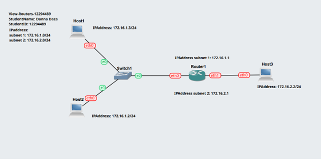
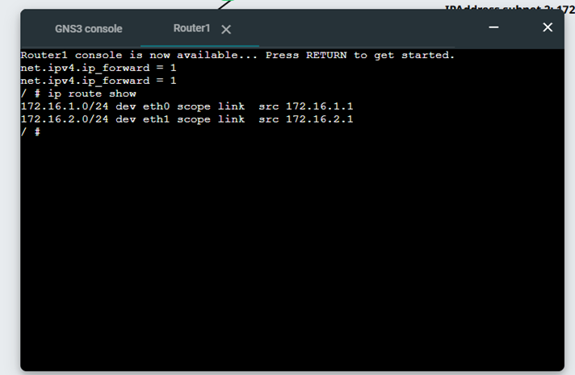
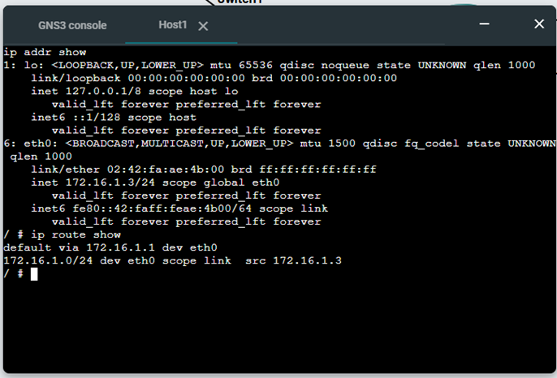
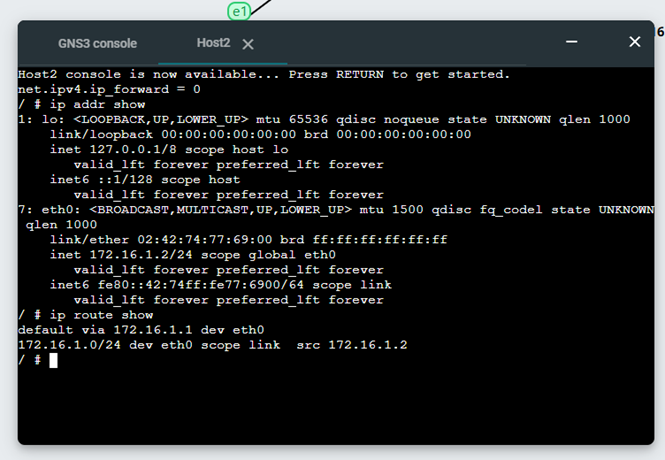
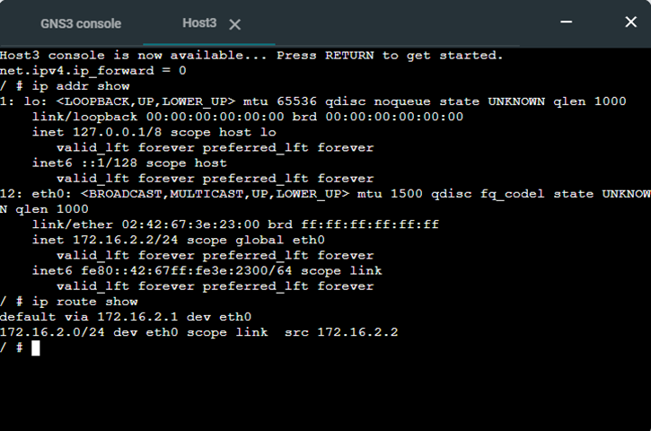
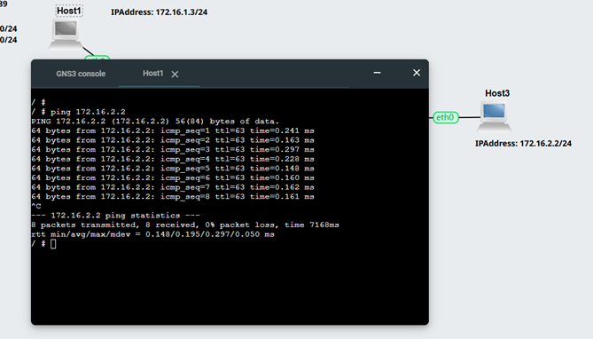

### Week 4
## Routing 
## View Routing Tables 

The aim of this week is to learn how to view routing tables and enable forwarding on a router using VirtualBox and GNS3.

## Activity 1 

1. Exported project, e.g., View-Routes-<studentid>.gns3project

   For this activity, I created a project called 'GNS3 View-Routes'. The link to the project is below.

   [GNS3-View-Routes](project_files/View-Routes-12294489.gns3project)

   
2. Screenshot of the network, e.g., View-Routes-<studentid>-network.png

   For this activity, my network consists of two Linux hosts connected to an Ethernet switch, then one router and one more Linux host connected to the router. See the following screenshot:

    .

   
3. Record of the IP addresses and routing tables of each host and router.

   Router:

   On the router, the ip route show command displays two directly connected networks: 172.16.1.0/24 on interface eth0 and 172.16.2.0/24 on interface eth1. This confirms that the router is correctly configured to connect both subnets.

    .

   Host 1

   On the host, the ip addr show and ip route show commands confirm that the IP address is correctly configured. The routing table shows a default route via the router, allowing the host to communicate with other networks.

   

   Host 2

   

   Host 3

   

4.	Screenshot of a successful ping from a host one one subnet to a host on the other subnet

   A successful ping test was performed using the ping command from a host in one subnet to a host in a different subnet. The results show that packets were sent and received without loss, see the following screenshot 

   

   

