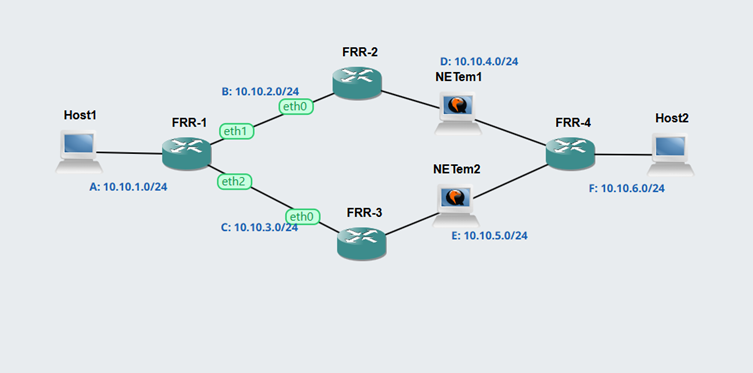
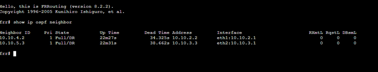
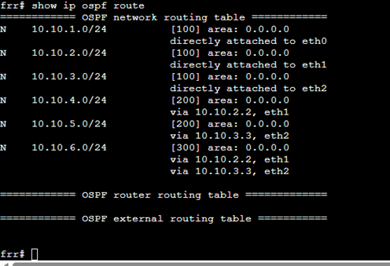
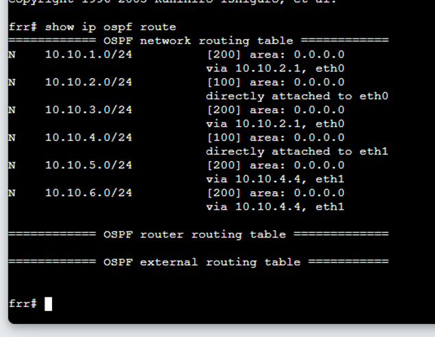
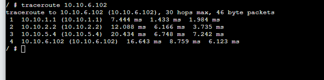
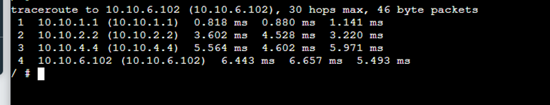

### Week 4
## Routing 
## View Routing Tables 

The aim of this week is to learn how to view routing tables and enable forwarding on a router using VirtualBox and GNS3.

## Activity 1 

1. Exported project, e.g., View-Routes-<studentid>.gns3project

   For this activity, I created a project called 'GNS3 View-Routes'. The link to the project is below.

   [GNS3-View-Routes](project_files/View-Routes-12294489.gns3project)

   
2. Screenshot of the network, e.g., View-Routes-<studentid>-network.png

   For this activity, my network consists of two Linux hosts connected to an Ethernet switch, then one router and one more Linux host connected to the router. See the following screenshot:

    .

   
3. Record of the IP addresses and routing tables of each host and router.

   Router:

   On the router, the ip route show command displays two directly connected networks: 172.16.1.0/24 on interface eth0 and 172.16.2.0/24 on interface eth1. This confirms that the router is correctly configured to connect both subnets.

    .

   Host 1

   On the host, the ip addr show and ip route show commands confirm that the IP address is correctly configured. The routing table shows a default route via the router, allowing the host to communicate with other networks.

   

   Host 2

   

   Host 3

   

4.	Screenshot of a successful ping from a host one one subnet to a host on the other subnet

   A successful ping test was performed using the ping command from a host in one subnet to a host in a different subnet. The results show that packets were sent and received without loss, see the following screenshot 

   

## Activity 2 

The objective of this activity is to observe how dynamic routing is set up and how it handles network changes.

1. Exported project, e.g., OSPF-Basics-<studentid>.gns3project

   For this step, I import the OSPF template and duplicate it as 'OSPF Basics - 12294489 - Project.gns3projects'. The link to the project is below.

   [GNS3-OSPF-Project](project_files/OSPF-Basics-12294489-Project.gns3project)

2. Screenshot of the network

  See the OSPF network in the screenshot below. 

   

   
3. Output (screenshot or copy-and-paste) showing neigbour routers of FRR1

   The output of the 'show ip ospf neighbor' command on the FRR1 console displays its neighbouring routers. The 'Full/DR' state confirms that OSPF adjacency has been successfully established with neighbouring routers (see screenshot below).

   

4. Output showing routing table for two routers.

   The routing table on FRR1, obtained using the show ip ospf route command, shows both directly connected networks and routes learned via OSPF. This confirms that OSPF is correctly exchanging routing information between routers.

   

   And the table on FRR2

    

6. Output of traceroute commands before and after the link is disconnected (by stopping the NETem node)

   Before:
   Disconnecting the link, the traceroute command shows the path taken from the source to the destination. The output includes multiple hops, indicating that packets are successfully routed through intermediate routers to reach the destination. See the following screenshot

   

   After:
   disconnecting the link, the traceroute output changes, showing a different path or failure to reach the destination. This demonstrates how network disruptions affect routing and how OSPF adapts to topology changes. See the following screenshot

   

## Reflection 

This week was more challenging as we started working with routing and multiple networks. I learnt how to view routing tables and understand how devices decide where to send data. Initially, it was difficult to read and understand the routing information, but it made more sense after some practice.

The most interesting part was working with dynamic routing using OSPF. I could see how the network automatically updates routes when changes occur, which is really useful in real-world scenarios. Using commands to check routing information also helped me to understand how routers communicate with each other.

   

   
   

  
   

