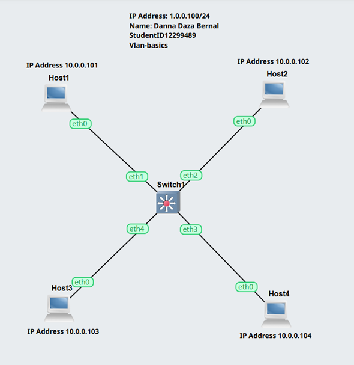
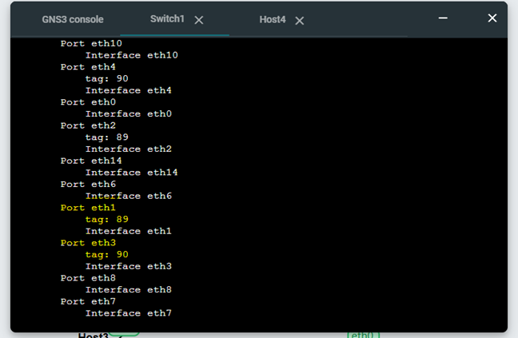
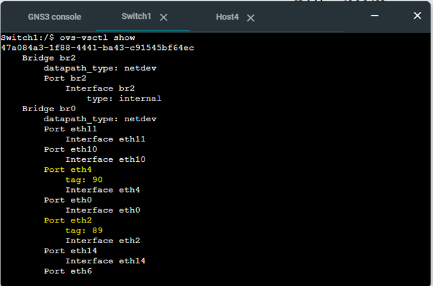
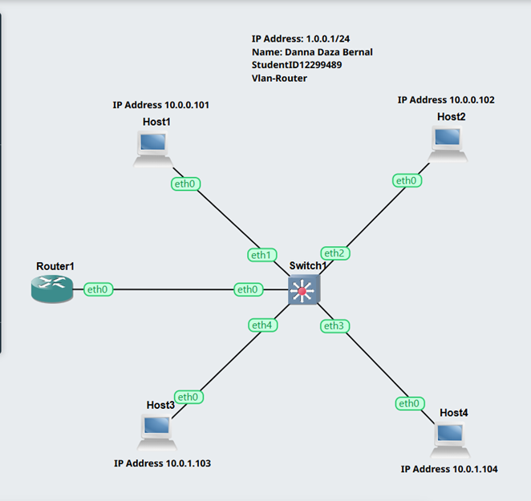

# Week 5 
## Switching and VLAN
## Setup VLANs on Swicth 

The aim of this week is to learn how to configure VLANs on a managed switch using VirtualBox and GNS3.

## Activity 1

1. Exported project, e.g., Vlan-Basics-<studentid>.gns3project

   in this step, I created a project called 'GNS3 Vlan-basics'. The link to the project is below.

   [Vlan-Basics](project_files/Vlans-Basics-12299489.gns3project)

2. Screenshot of the network

   in this step, I created a network with 4 linux host and one swicth, see the following image:

   

3.  Screenshot showing the ports and tags on the switch

   The output shows the configuration of the switch ports and their assigned VLAN tags. Each port was configured as an access port and assigned a specific VLAN ID using Open vSwitch commands ovs-vsctl set port ethx tag. Port 1 and 2 tag 89 and port 3 and 4 tag 90, see de following image 

   Ports 1 and 3 
   
   

   Ports 2 and 4 

   

## Activity 2 

1. Exported project, e.g., Vlan-Router-<studentid>.gns3project

   In this step, I duplicated the previous project and changed its name to 'Vlan-Router'. See the following link:

   [Vlan-Router-Project](project_files/Vlan-Router-12299489.gns3project).

2. Screenshot of the network

   In this case, I added a router to the network. See the screenshot below:

   

## Reflection 

This week's topic was VLANs, which I found really interesting because it showed me how a single network can be divided into smaller segments. I learnt how to configure VLANs on a switch, as well as the fact that devices in different VLANs cannot communicate with each other unless properly configured.

Initially, I found it difficult to understand how VLAN tagging works, particularly in relation to trunk ports and router configuration. However, once I had followed the steps and tested the connectivity, everything became clearer. I also learned how routers can be used to enable communication between VLANs, a common feature in real networks. Overall, this week helped me to improve my understanding of network segmentation and security.
   

   
