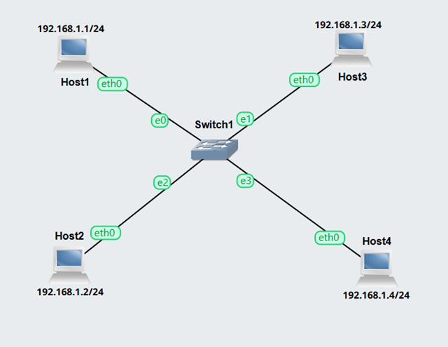
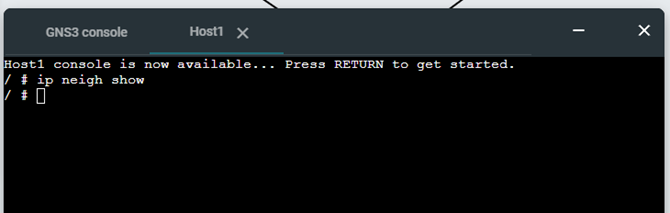
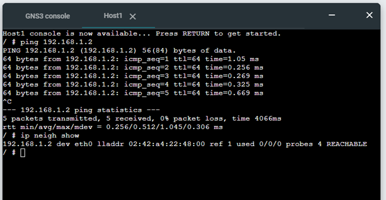
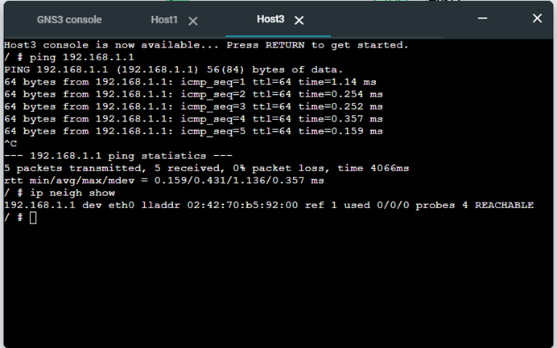
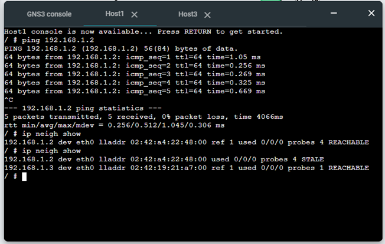
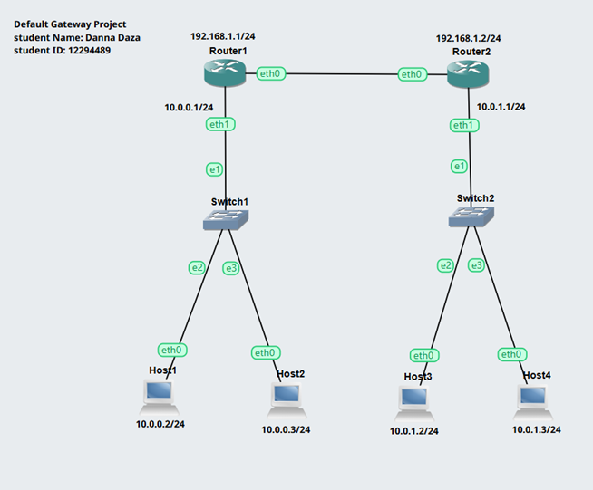
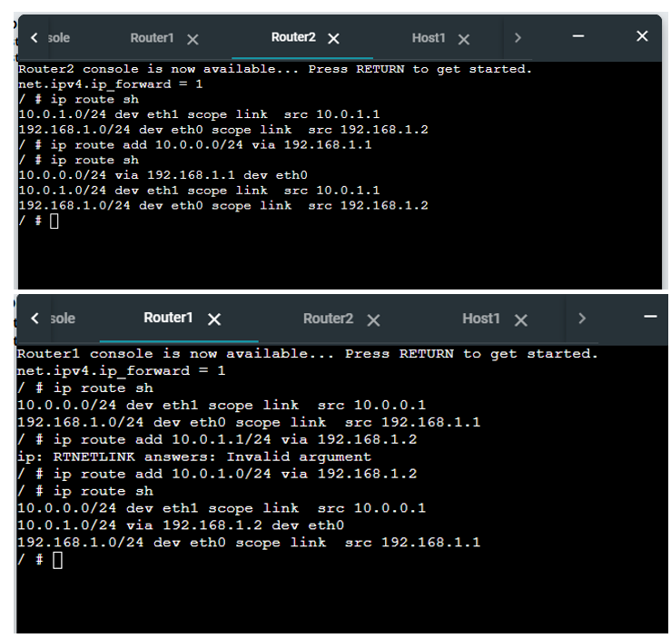
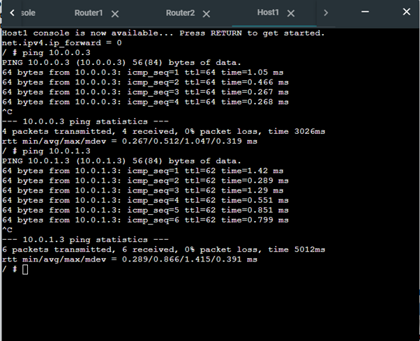

# Week 6 
## Address Resolution and Management 
## Resolving IP Addresses to Hardware Addresses 

The aim this week is to see how ARP enables devices to maintain a record of the mapping between IP addresses and hardware addresses within a local area network (LAN). 

## Activity 1 

1. Screenshots of ARP tables of host A at different time points that illustrate the changes in the ARP table as devices communicate. This may be a single screenshot

   In this step, I duplicate a previous project in GNS3 for this activity, with four Linux hosts and one switch. The network is shown in the following screenshot.

   

   Then, in the Host 1 console, I typed the 'ip neigh show' command to view the ARP table. See the following output

   

   In this step, after using the ping command to communicate with another host using its IP address, I used the ip neigh show command to display the ARP table. The output confirms that the MAC address of the destination host was successfully learned. see the following image

   

   Also host 3 ping host 1, screenshot is below

   

   Now the host 1 ARP table using ip neigh show command, see the follong image

   

## Activity 2 

1. Exported project, e.g., Default-Gateway-<studentid>.gns3project

   For this activity, I created a Default-Gateway project in GNS3, see the link below:

   [Default-Gateway-Project](project_files/Default-Gateway-12294489.gns3project)

2. Screenshot of the network.

   For this step, I created a network with four linux host, 2 ethernet switch and 2 routers, see the following image

   

 3. Record of the IP addresses and routing tables of each host and router.

    The following table shows the IP address configuration for all devices in the network, including routers and hosts across different subnets.

    | Device   | Interface | IP Address      | Subnet |
    |----------|-----------|-----------------|--------|
    | Router1  | eth0      | 192.168.1.1     | /24    |
    | Router1  | eth1      | 10.0.0.1        | /24    |
    | Router2  | eth0      | 192.168.1.2     | /24    |
    | Router2  | eth1      | 10.0.1.1        | /24    |
    | Host1    | eth0      | 10.0.0.2        | /24    |
    | Host2    | eth0      | 10.0.0.3        | /24    |
    | Host3    | eth0      | 10.0.1.2        | /24    |
    | Host4    | eth0      | 10.0.1.3        | /24    |

  4. Screenshot of a successful ping from a host one one subnet to a host on the other subnet.
     
     For this step, the routing tables on both routers were configured using the `ip route add` command to enable communication between different subnets. On Router1, a route was added to reach the network `10.0.1.0/24` via Router2 (`192.168.1.2`). Similarly, on Router2, a route was added to reach the network `10.0.0.0/24` via Router1 (`192.168.1.1`). The updated routing tables confirm that both routers are aware of the remote networks, allowing traffic to be forwarded correctly between subnets.

     

     The `ping` command was used to test connectivity between hosts in different subnets. The results show that packets were successfully sent and received, this demonstrates that the routing configuration has been successfully implemented. See the following image

     

     
## Reflection 

This week's focus on ARP and default gateways helped me to understand how devices find each other within a network. I learnt how ARP maps IP addresses to physical (MAC) addresses, and how the ARP table changes when devices communicate. Seeing how this process happens automatically in the background was interesting.

I also learnt how default gateways allow communication between different networks. Initially, I found it difficult to understand when a gateway is needed, but after conducting some ping tests, this became clearer. Overall, this week helped me to connect previous topics such as IP addressing and routing, and understand how everything works together in a network.

   

